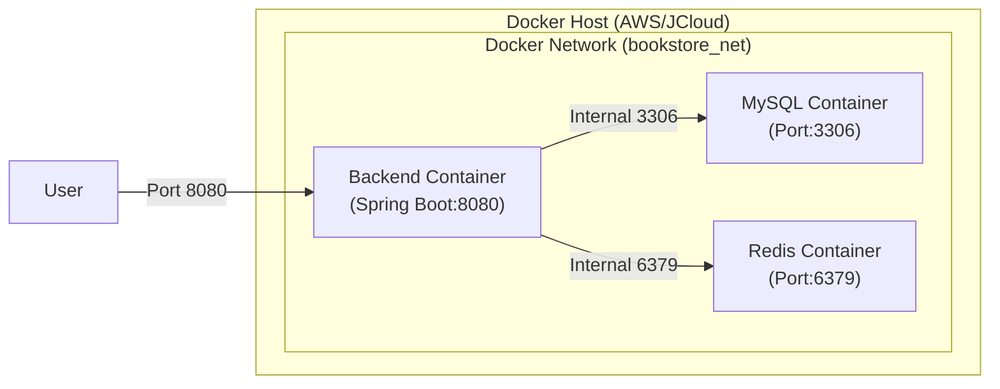

# 프로젝트 아키텍처

## 개요

온라인 서점 백엔드 API 서버의 계층 구조 및 모듈 설계 문서입니다.

---

## 기술 스택

| 구분 | 기술 |
|------|------|
| **Framework** | Spring Boot 3.2.0 |
| **Language** | Java 17 |
| **Database** | MySQL 8.0, **Redis 8.4** (Cache/Session) |
| **ORM** | Spring Data JPA (Hibernate) |
| **Authentication** | JWT, OAuth2 (Google), Firebase |
| **Infrastructure** | Docker, Docker Compose |
| **CI/CD** | GitHub Actions, GHCR |
| **Documentation** | Swagger/OpenAPI 3.0 |
| **Build Tool** | Gradle 8.5 |
| **Test** | JUnit 5, Spring MockMvc |

---

## 계층 구조 (Layered Architecture)

```
┌─────────────────────────────────────────────────────────────┐
│                      Client (Frontend)                       │
└─────────────────────────────────────────────────────────────┘
                              │
                              ▼
┌─────────────────────────────────────────────────────────────┐
│                    Controller Layer                          │
│  - REST API 엔드포인트 정의                                   │
│  - 요청/응답 처리                                             │
│  - 입력 유효성 검증 (@Valid)                                  │
│  - Swagger 문서화 (@Operation, @Tag)                         │
└─────────────────────────────────────────────────────────────┘
                              │
                              ▼
┌─────────────────────────────────────────────────────────────┐
│                     Service Layer                            │
│  - 비즈니스 로직 구현                                         │
│  - 트랜잭션 관리 (@Transactional)                            │
│  - 예외 처리 (BusinessException)                             │
│  - DTO <-> Entity 변환                                       │
└─────────────────────────────────────────────────────────────┘
                              │
                              ▼
┌─────────────────────────────────────────────────────────────┐
│                   Repository Layer                           │
│  - 데이터 접근 계층                                           │
│  - Spring Data JPA 인터페이스                                 │
│  - 커스텀 쿼리 메서드                                         │
└─────────────────────────────────────────────────────────────┘
                              │
                              ▼
┌─────────────────────────────────────────────────────────────┐
│                      Database (MySQL)                        │
└─────────────────────────────────────────────────────────────┘
```

---

## 패키지 구조

```
com.example.bookstore/
│
├── BookstoreApplication.java       # Spring Boot 메인 클래스
│
├── config/                         # 설정 클래스
│   ├── SecurityConfig.java         # Spring Security 설정
│   ├── SwaggerConfig.java          # Swagger/OpenAPI 설정
│   ├── RateLimitFilter.java        # Rate Limiting 필터
│   ├── FirebaseConfig.java         # Firebase 설정 (New)
│   └── DataInitializer.java        # 시드 데이터 초기화
│
├── controller/                     # REST 컨트롤러
│   ├── AuthController.java         # 인증 API
│   ├── UserController.java         # 사용자 API
│   ├── BookController.java         # 도서 API (Public)
│   ├── AdminBookController.java    # 도서 API (Admin)
│   ├── AdminUserController.java    # 사용자 관리 API (Admin)
│   ├── AdminOrderController.java   # 주문 관리 API (Admin)
│   ├── CartController.java         # 장바구니 API
│   ├── OrderController.java        # 주문 API
│   ├── ReviewController.java       # 리뷰 API
│   ├── FavoriteController.java     # 찜 API
│   └── HealthController.java       # 헬스체크 API
│
├── service/                        # 비즈니스 로직
│   ├── AuthService.java            # 인증 서비스
│   ├── CustomOAuth2UserService.java# OAuth2 사용자 서비스 (New)
│   ├── UserService.java            # 사용자 서비스
│   ├── BookService.java            # 도서 서비스
│   ├── CartService.java            # 장바구니 서비스
│   ├── OrderService.java           # 주문 서비스
│   ├── ReviewService.java          # 리뷰 서비스
│   └── FavoriteService.java        # 찜 서비스
│
├── repository/                     # 데이터 접근
│   ├── UserRepository.java
│   ├── BookRepository.java
│   ├── CartRepository.java
│   ├── CartItemRepository.java
│   ├── OrderRepository.java
│   ├── OrderItemRepository.java
│   ├── ReviewRepository.java
│   ├── FavoriteRepository.java
│   └── RefreshTokenRepository.java
│
├── entity/                         # JPA 엔티티
│   ├── User.java
│   ├── Book.java
│   ├── Cart.java
│   ├── CartItem.java
│   ├── Order.java
│   ├── OrderItem.java
│   ├── Review.java
│   ├── Favorite.java
│   └── RefreshToken.java
│
├── dto/                            # 데이터 전송 객체
│   ├── ApiResponse.java            # 공통 응답 DTO
│   ├── ErrorResponse.java          # 에러 응답 DTO
│   ├── PageResponse.java           # 페이지네이션 응답 DTO
│   ├── auth/                       # 인증 관련 DTO
│   ├── user/                       # 사용자 관련 DTO
│   ├── book/                       # 도서 관련 DTO
│   ├── cart/                       # 장바구니 관련 DTO
│   ├── order/                      # 주문 관련 DTO
│   ├── review/                     # 리뷰 관련 DTO
│   └── favorite/                   # 찜 관련 DTO
│
├── security/                       # 보안 관련
│   ├── JwtTokenProvider.java       # JWT 토큰 생성/검증
│   ├── JwtAuthenticationFilter.java # JWT 인증 필터
│   ├── CustomOAuth2User.java       # OAuth2 사용자 정보 (New)
│   └── CustomUserDetailsService.java # 사용자 인증 서비스
│
└── exception/                      # 예외 처리
    ├── ErrorCode.java              # 에러 코드 정의
    ├── BusinessException.java      # 비즈니스 예외
    └── GlobalExceptionHandler.java # 전역 예외 핸들러
```

---

## 의존성 흐름

```
Controller → Service → Repository → Database
     │           │
     │           └── Entity (JPA)
     │
     └── DTO (Request/Response)
```

### 규칙
- **Controller**: Service만 의존
- **Service**: Repository만 의존, 다른 Service 의존 가능
- **Repository**: Entity만 의존
- **Entity**: 외부 의존성 없음 (POJO)

---

## 보안 아키텍처

### 인증 흐름

```
1. 로그인 요청
   Client → POST /api/auth/login → AuthController → AuthService
                                                         │
                                                         ▼
                                               JwtTokenProvider
                                               (Access + Refresh Token 발급)
                                                         │
                                                         ▼
                                                    Client

2. 인증된 요청
   Client (Authorization: Bearer {token})
       │
       ▼
   JwtAuthenticationFilter (토큰 검증)
       │
       ▼
   SecurityContext (사용자 정보 저장)
       │
       ▼
   Controller (@AuthenticationPrincipal User user)
```

1. 일반 로그인 (JWT)
   Client: POST /api/auth/login 요청.
   - Server: ID/PW 검증 후 JwtTokenProvider를 통해 Access Token 및 Refresh Token 발급.
   - Client: 이후 요청 헤더에 Authorization: Bearer {token} 포함.


2. 소셜 로그인 (OAuth2 - Google) Client: /oauth2/authorization/google 로 접근하여 구글 로그인 페이지 리다이렉트.
   - Provider: 인증 후 Authorization Code와 함께 서버로 리다이렉트.

   - Server: CustomOAuth2UserService: 사용자 정보 로드 및 DB 저장/갱신.
   - OAuth2SuccessHandler: 인증 성공 후 JWT 생성하여 클라이언트로 리다이렉트 (Query Parameter 등으로 토큰 전달).

### 권한 체계

| Role | 설명 | 접근 가능 API |
|------|------|---------------|
| `PUBLIC` | 비인증 | /api/auth/**, /api/public/**, /health |
| `ROLE_USER` | 일반 사용자 | /api/users/me, /api/carts/**, /api/orders/**, /api/reviews/**, /api/favorites/** |
| `ROLE_ADMIN` | 관리자 | /api/admin/** (모든 기능) |

---

## 에러 처리 전략

### 예외 계층

```
Exception
    └── RuntimeException
            └── BusinessException (커스텀 예외)
                    │
                    └── ErrorCode (에러 코드 enum)
```

### 처리 흐름

```
예외 발생 → GlobalExceptionHandler → ErrorResponse 생성 → JSON 응답
```

### 응답 형식

```json
{
  "timestamp": "2025-01-15T12:00:00",
  "path": "/api/books/999",
  "status": 404,
  "code": "BOOK_NOT_FOUND",
  "message": "도서를 찾을 수 없습니다",
  "details": null
}
```

---

## 성능 최적화

### 1. 페이지네이션
- Spring Data JPA의 `Pageable` 사용
- 기본 페이지 크기: 20
- 최대 페이지 크기: 100

### 2. 인덱스
- 검색 대상 필드: title, author, publisher, isbn
- 조인 대상 필드: user_id, book_id, order_id

### 3. Rate Limiting
- IP당 분당 100회 제한
- 429 Too Many Requests 응답

---

## 테스트 전략

### 테스트 구성

| 유형 | 위치 | 설명 |
|------|------|------|
| 통합 테스트 | `src/test/java/.../controller/` | MockMvc 기반 API 테스트 |

### 테스트 커버리지
- AuthControllerTest: 5개
- BookControllerTest: 9개
- CartControllerTest: 3개
- OrderControllerTest: 4개
- ReviewControllerTest: 7개
- FavoriteControllerTest: 4개
- **총 32개 테스트**

---

## 배포 구성

### JCloud 배포 (Docker Compose)
- docker Compose를 통해 App, DB, Cache가 격리된 네트워크 환경에서 구동됩니다.


### CI/CD 파이프라인 (GitHub Actions)
1. Code Push: 개발자가 GitHub에 코드 푸시.

2. CI (Test): gradle test 자동 실행.

3. CD (Build & Push):

    - release 브랜치 병합 시 Docker Image 빌드.

    - GHCR(GitHub Container Registry)에 이미지 업로드.

4. Deploy: 서버에서 docker-compose pull 및 up으로 최신 버전 배포.

### 프로세스 관리
- nohup 또는 systemd 서비스로 백그라운드 실행
- 서버 재시작 시 자동 구동
